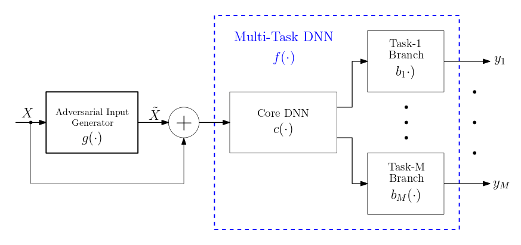

# MAT: A Real-Time Multi-Objective Adversarial Attack on Multi-Task Deep Neural Networks



## DEPENDENCIES

This project requires `Python 3.10` is used together with `PyTorch 1.13.0`.

For this project you can use either Python venv of conda. To install dependecies, use the `install_dependencies.sh`.

```
    sh install_dependencies.sh
```

## CUDA INFO

| NVIDIA-SMI 515.65.01    Driver Version: 515.65.01    CUDA Version: 11.7     |
|-----------------------------------------------------------------------------|


## COMET
Comet is free open-source library that allows to record and track experiments results using an API.
First create an account on https://www.comet.ml/ and get a new API key. Update **COMET_APIKEY** in "config.py" with your API key.

## DATASET
Download and prepare the Taskonomy dataset as suggested in https://github.com/columbia/MTRobust/. 
Update the path to the taskonomy dataset  Update **TASKONOMY_DATASET** in `config.py`.

## HOW TO USE

1. Clone this repo.

2. Create Python virtual environment.

3. Update PYTHONPATH variable to point to this repo. Preferable way is to add following line in your `~/.bashrc` file:

        export PYTHONPATH='path/to/clone/repo/MAT-Attack/'

4. Open a new terminal so the `~/.bashrc` exectues.

5. Open the already created Python environment and install all dependencies with:

        sh install_dependencies.sh

6. Make sure you have CUDA version compatible with PyTorch version.

7. Download pretrained multi-task neural network models (2 tasks max for now) from [here](https://drive.google.com/drive/folders/1XQVpv6Yyz5CRGNxetO0LTXuTvMS_w5R5). Thank you Trevor Standley.

8. Update `config.py`.

9. Navigate to MAT_utils/utils_aux_MAT_attack.py and add your workspace name as default to Experiment() in line 298.

10. Navigate to `MAT-Attack/learning/MAT_learning/` and run the following line for 1 iteration training and validation on a single image.

        CUDA_VISIBLE_DEVICES=0 python3 train_MAT_attack_generator.py

11. To make modifications such as number of epochs, batch size, and so on, see the available arguments on top of `train_MAT_attack_generator.py`.

12. To run more than 1 iteration of the algorithm, make sure you attach the following argument: `--single_img_tests False` to the command in step 9.

## ACKNOWLEDGEMENT

This code is based on [GAP](https://github.com/OmidPoursaeed/Generative_Adversarial_Perturbations), [Taskaugment](https://github.com/yamizi/taskaugment), and [MTRobust](https://github.com/columbia/MTRobust/). 
